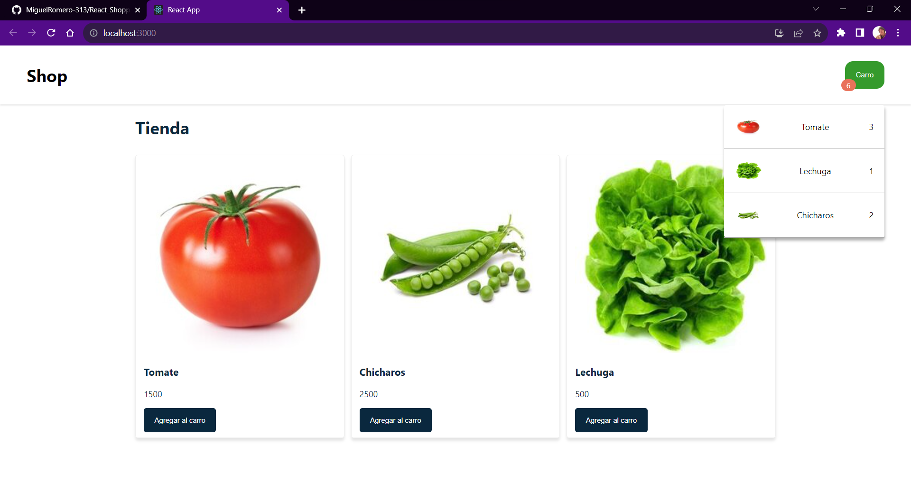

# React Shopping Cart 🛒

## A simple React Shopping Cart - state management in class based components: created with create-react-app

Created by: Miguel Romero

install steps:

1. Clone this repository (git clone: https://github.com/MiguelRomero-313/React_ShoppingCart.git)
2. in terminal execute: npm install
3. run the development server with: npm run start
